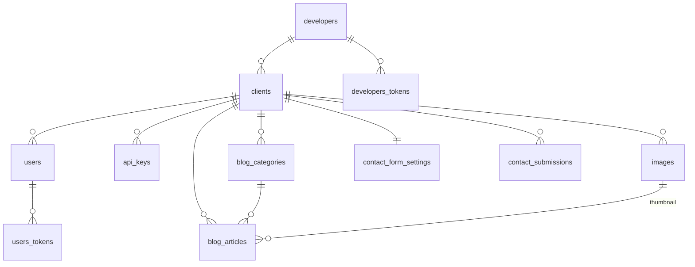

# antpress データモデル

> `DECISIONS.md` の決定事項に基づくテーブル定義。Ecto マイグレーションを書ける粒度。
> 最終更新: 2026-09-03

## 1. 設計方針

### 1.1 テナント分離：共有スキーマ ＋ `client_id`

| 方式 | 採否 | 理由 |
| --- | --- | --- |
| **共有スキーマ ＋ `client_id` 列** | **採用** | 小規模・1 人運用に対して十分。マイグレーションが 1 回で済む |
| スキーマ分離（クライアントごとに schema） | ✕ | クライアントが増えるたびにマイグレーションが増え、運用が破綻する |
| Supabase RLS | ✕ | RLS はクライアントが Postgres に直接触る構成（PostgREST）向け。antpress は Ecto 経由なので不要 |

**分離はアプリケーション層で強制する。** クライアントに紐づく全テーブルに
`client_id` を持ち、コンテキスト関数が必ず `client_id` を引数に取る設計にする。

```elixir
# ✅ client_id を必ず受け取る
def list_articles(client_id, opts \\ []) do
  Article |> where(client_id: ^client_id) |> ...
end

# ❌ スコープなしのクエリを書かない
def list_articles, do: Repo.all(Article)
```

配信 API では **API キーから `client_id` を解決する**ため、リクエストの
パラメータに含まれる ID を信用する必要がない（→ `DECISIONS.md` 3.7）。

#### developer 層のスコープも同様に強制する

3 階層モデル（→ `DECISIONS.md` 1.3）なので、**スコープは 2 段になる。**

```elixir
# developer は自分のクライアントしか触れない
def get_client!(%Developer{role: :admin}, id), do: Repo.get!(Client, id)
def get_client!(%Developer{id: dev_id}, id) do
  Client |> where(developer_id: ^dev_id) |> Repo.get!(id)
end
```

**`role = admin` だけがスコープを越えられる。** developer が他の developer の
クライアントを取得できてはならない。ここが漏れると**他社の商売の中身が見える**ため、
最も注意すべき箇所。

### 1.2 主キーは UUID

全テーブルで `binary_id`（UUID）を使う。

- 配信 API のレスポンスに ID が露出するため、連番だと**レコード数が漏れ、
  ID の推測による列挙が可能になる**
- Phoenix 設定: `@primary_key {:id, :binary_id, autogenerate: true}`

### 1.3 スラッグの一意性はクライアント単位

複数クライアントが同じ `hello-world` を持てる必要があるため、
`UNIQUE (client_id, slug)` にする。グローバル一意にはしない。

### 1.4 ドメインごとにテーブル名を接頭辞で分ける

ブログ領域のテーブルには **`blog_` 接頭辞**を付ける。

| テーブル | 理由 |
| --- | --- |
| `blog_categories` | EC 対応時に `commerce_categories` が必要になる。素の `categories` だと実際には「ブログのカテゴリ」なのに汎用的な名前になり誤解を招く |
| `blog_articles` | 単独では `products` と衝突しないが、**接頭辞が半分だけ付いた状態は「意図」より「事故」に見える**。4 テーブル全てを揃える |

> ℹ️ **外部キーの列名は `article_id` のまま**（`blog_article_id` にしない）。
> Ecto の `belongs_to :article` はテーブル名に関係なく `article_id` を生成するため、
> こちらが慣例に沿う。
>
> ℹ️ **配信 API のパスは `/api/v1/articles` のまま。** テーブル名は内部の都合、
> エンドポイント名は公開契約なので、揃える必要はない。

**Phoenix のコンテキストと対応する。**

```
AntPress.Platform  → developers, developers_tokens   （admin / developer）
AntPress.Tenancy   → clients                          （テナント）
AntPress.Accounts  → users, users_tokens              （owner / staff）
AntPress.Blog      → blog_articles, blog_categories
AntPress.Commerce  → （将来）commerce_products, commerce_categories, ...
```

> ℹ️ これは**リネームであって機能追加ではない**ため、
> 「EC を見越してデータモデルを複雑にしない」（`DECISIONS.md` 3.9）と矛盾しない。
> 後からのテーブル名変更はマイグレーションとコード全体の修正を伴うが、
> 今名前を決めるコストはゼロ。

#### 採用しない案：ポリモーフィックな共通テーブル

`categories` テーブルに `taxonomy_type` 列を持たせてブログと商品の両方を扱う案は
**採らない。**

- 外部キーに型がつかず、ブログ記事が商品カテゴリを参照できてしまう
- 「固定スキーマ」の設計思想（`DECISIONS.md` 1.2）に反する
- ドメインごとに独立したテーブルを持つ方が単純で安全

### 1.5 タグは作らない

**`blog_tags` / `blog_article_tags` は設けない。** カテゴリのみで分類する。

| 理由 | 内容 |
| --- | --- |
| **SEO にマイナス** | 記事 20 本規模だとタグページ 1 枚が記事 1〜3 本になり **thin content** になる。同じ記事が `/category/x` `/tag/y` `/tag/z` に現れて**重複コンテンツとインデックス膨張**を招く。実務では小規模サイトのタグページを `noindex` にすることが多く、それなら最初から作らない方が筋が通る |
| **表記が分裂する** | クライアント（店舗オーナー）が投稿ごとにタグを選ぶと「ラーメン」「らーめん」「ラーメン情報」が別タグとして乱立する。WordPress サイトで繰り返し観測される失敗 |
| **設計思想と一致する** | タグは「存在するが大半のサイトで正しく使われていない WordPress 機能」の典型。ここで外さないと `DECISIONS.md` 1.2 の思想と実装が食い違う |

Qiita / Zenn でタグが機能するのは記事が数万本あるため。閾値を超えないと逆に働く。

**カテゴリを複数選択にもしない。** タグを外した埋め合わせにカテゴリを複雑にすると
同じ問題（分類の乱立）が起きる。**1 記事 1 カテゴリ**という単純なモデルを保つ。

> ℹ️ 後戻りは容易。必要になればテーブル 2 つを追加する純粋な追加マイグレーションで済む。

---

## 2. ER 図



`developers` が最上位。`admin` は `developers.role = admin` のレコードで表す（→ 3.1）。

---

## 3. テーブル定義

### 3.1 `developers` — admin / developer


**`admins` テーブルは作らない。** `role` で admin と developer を区別し、
**admin 自身も 1 レコードを持つ**（→ `DECISIONS.md` 1.3）。

| カラム | 型 | 制約 | 説明 |
| --- | --- | --- | --- |
| `id` | uuid | PK | |
| `role` | enum | not null, default `developer` | `admin` / `developer`。DB 側に CHECK 制約も張る |
| `name` | string | not null | 屋号・氏名 |
| `email` | **citext** | not null, unique | 大文字小文字を区別しない（`phx.gen.auth` が採用） |
| `hashed_password` | string | **nullable** | パスワードは**任意**（→ 下記） |
| `anthropic_api_key` | binary | | **暗号化して保存**（→ 下記） |
| `status` | enum | not null, default `active` | `active` / `suspended` |
| `note` | text | | **admin 専用メモ**（契約日・年額・入金状況などの自由記述） |
| `confirmed_at` | utc_datetime | | |
| `inserted_at` / `updated_at` | utc_datetime | not null | |

- `role = admin` は課金対象外
- **決済カラムは持たない。** Stripe 連携は実装せず、請求は antpress の外で手動
  （→ `DECISIONS.md` 3.10）。契約日・請求日・支払い状態のような**状態機械を持たない**
- `status = suspended` は **admin の手動操作**。これが実質の課金コントロールになる
  - **管理画面と配信 API の両方を止める。** 操作は 1 つ（→ `DECISIONS.md` 3.10）
  - 配信 API は `403` を返す。**停止理由が分かるメッセージを含める**
  - SSG 前提なので実際の影響は「サイトが落ちる」ではなく「更新が止まる」
- `users` とテーブルを分ける理由: `developers` はプラットフォーム側、
  `users` はテナント側のアカウント。分けることで
  **「`users` のクエリは必ず `client_id` で絞る」という不変条件**が保てる
- ログイン導線: `/log_in`（developer / admin 共通）と `/client/log_in`（→ `SCREENS.md`）

#### 認証はマジックリンク優先、パスワードは任意

`mix phx.gen.auth`（Phoenix 1.8）が生成する方式に合わせる。

- **`hashed_password` は nullable。** メールのマジックリンクでログインでき、
  パスワードは本人が任意で設定する
- **セルフサインアップは行わない**（→ `DECISIONS.md` 1.3）。生成された
  `/developers/register` は削除済み。作成経路は次の 2 つだけ:
  1. 最初の admin → `priv/repo/seeds.exs`
  2. 以降の developer → admin が発行（画面 A2）
- ⚠️ **パスワードを設定するなら `confirmed_at` も必ず入れる。**
  「未確認かつパスワード設定済み」の状態はマジックリンクログインが `raise` する
  （credential pre-stuffing 対策。`mix help phx.gen.auth` 参照）
- パスワードハッシュは **bcrypt**。argon2 はより堅牢だが CPU・メモリを多く要し、
  Fly.io の小さいインスタンスに合わない

#### ⚠️ Anthropic API キーは「暗号化」する。ハッシュではない

**キーの保存方法が 2 種類あることに注意。**

| キー | 保存方法 | 理由 |
| --- | --- | --- |
| `api_keys.key_hash`（antpress の配信キー） | **ハッシュ（SHA-256）** | 検証するだけなので不可逆でよい |
| `developers.anthropic_api_key` | **暗号化（可逆）** | Claude API を叩くのに**平文が必要**。ハッシュにはできない |

- Elixir では **`cloak_ecto`**（AES-GCM）を使う
- 暗号鍵は環境変数から読む。**DB には置かない**
- 漏洩すると **developer の Anthropic 残高が第三者に使われる**ため、
  平文保存・ログ出力は禁止
- 管理画面では**末尾数文字のみ表示**し、全体は表示しない
- 鍵ローテーションの手順を用意しておく（`cloak` は複数鍵での復号に対応）

### 3.2 `developers_tokens`

`mix phx.gen.auth` が生成する標準テーブル。

| カラム | 型 | 用途 |
| --- | --- | --- |
| `token` | binary | ハッシュ化されたトークン |
| `context` | string | 用途（`session` / `login` / `change:<email>`） |
| `sent_to` | string | 送信先メール（メール変更の検証用） |
| `authenticated_at` | utc_datetime | sudo モードの判定に使う |

`Repo.delete_all` で失効させる設計なので `updated_at` は持たない。

### 3.3 `clients` — クライアント（テナント）


| カラム | 型 | 制約 | 説明 |
| --- | --- | --- | --- |
| `id` | uuid | PK | |
| `developer_id` | uuid | FK, **not null** | 契約している developer。**admin 直契約は admin 自身の developer レコードを指す** |
| `name` | string | not null | クライアント名（例: ラーメン太郎） |
| `slug` | string | not null, unique | 運営者向けの識別子 |
| `plan` | enum | not null | `basic` / `ai` |
| `contact_notification_email` | string | | お問い合わせの転送先（→ 3.10） |
| `webhook_url` | string | | 公開時に POST する URL（→ 3.7） |
| `status` | enum | not null, default `active` | `active` / `suspended` |
| `inserted_at` / `updated_at` | utc_datetime | not null | |

- `status = suspended` のクライアントは、管理画面ログインと配信 API の両方を拒否する
  （契約終了時に**データを消さずに止められる**）
- `developer_id` が **非 NULL** なので「直接契約」の特別扱いが不要（→ `DECISIONS.md` 1.3）
- `developer_id` は**変更可能**にする。developer が辞めた際にクライアントを
  admin や別の developer へ移管できる（実装コストはほぼゼロ）
- **AI プランに設定できるのは、その developer が Anthropic キーを登録済みの場合のみ**

### 3.4 `users` — オーナー / スタッフ


| カラム | 型 | 制約 | 説明 |
| --- | --- | --- | --- |
| `id` | uuid | PK | |
| `client_id` | uuid | FK, not null | |
| `email` | string | not null, unique | グローバル一意（1 メール = 1 アカウント） |
| `hashed_password` | string | not null | |
| `role` | enum | not null | `owner` / `staff` |
| `confirmed_at` | utc_datetime | | |
| `inserted_at` / `updated_at` | utc_datetime | not null | |

- `owner` は**運営者が発行**、`staff` は**オーナーが発行**（→ `DECISIONS.md` 3.5）
- `staff` はスタッフアカウントを発行できない

### 3.5 `users_tokens` — セッション / メール確認 / パスワード再設定


`mix phx.gen.auth` が生成する標準テーブルをそのまま使う。

### 3.6 `api_keys` — 配信 API キー


| カラム | 型 | 制約 | 説明 |
| --- | --- | --- | --- |
| `id` | uuid | PK | |
| `client_id` | uuid | FK, not null | |
| `name` | string | not null | 用途（例: 本番用 / ステージング用） |
| `key_hash` | binary | not null, unique | **SHA-256 ハッシュ**。平文は保存しない |
| `key_prefix` | string | not null | 表示用の先頭数文字（例: `ap_live_a1b2…`） |
| `last_used_at` | utc_datetime | | |
| `revoked_at` | utc_datetime | | null なら有効 |
| `inserted_at` / `updated_at` | utc_datetime | not null | |

- 平文キーは**発行時に一度だけ表示**し、以後は復元不可
- SHA-256 を使う理由: 毎リクエスト検証するため。bcrypt / Argon2 は遅すぎる。
  キーは高エントロピー（32 バイト乱数）なので総当たり耐性は問題にならない

### 3.7 `blog_categories` — カテゴリ


| カラム | 型 | 制約 | 説明 |
| --- | --- | --- | --- |
| `id` | uuid | PK | |
| `client_id` | uuid | FK, not null | |
| `name` | string | not null | |
| `slug` | string | not null | `UNIQUE (client_id, slug)` |
| `position` | integer | not null, default 0 | 表示順 |
| `inserted_at` / `updated_at` | utc_datetime | not null | |

- クライアント作成時に**業種横断のプリセットを投入**する（→ `DECISIONS.md` 3.2）
- 記事は 1 カテゴリのみ選択 → `blog_articles.category_id` で表現（中間テーブル不要）

### 3.8 `blog_articles` — 記事


| カラム | 型 | 制約 | 説明 |
| --- | --- | --- | --- |
| `id` | uuid | PK | |
| `client_id` | uuid | FK, not null | |
| `title` | string | not null | |
| `slug` | string | not null | `UNIQUE (client_id, slug)` |
| `body_format` | enum | not null | `rich_text` / `markdown`（→ 切り替え要件） |
| `body` | text | | 入力された生データ |
| `body_html` | text | | **配信用にレンダリング済みの HTML** |
| `source_text` | text | | **原文**（AI プラン専用） |
| `generation_status` | enum | not null, default `idle` | `idle` / `generating` / `failed` |
| `generation_error` | text | | 失敗時のメッセージ |
| `category_id` | uuid | FK | null 許容 |
| `thumbnail_image_id` | uuid | FK → `images` | null 許容 |
| `status` | enum | not null, default `draft` | `draft` / `published` |
| `published_at` | utc_datetime | | 公開日時。未来日時なら予約投稿 |
| `published_notified_at` | utc_datetime | | Webhook 通知済みの時刻（→ 5.1） |
| `inserted_at` / `updated_at` | utc_datetime | not null | |

**`body_html` を持つ理由**: 配信 API が HTML を返せば、**HP 側に Markdown
パーサが不要**になる。保存時にレンダリングしてキャッシュする。

**予約投稿の表現**: `status = published` かつ `published_at` が未来。
専用の `scheduled` ステータスは作らない。配信条件を
`status = 'published' AND published_at <= now()` にするだけで成立する。

**`generation_status` を持つ理由**: AI 生成は非同期（数十秒）。
ブラウザを閉じても生成は継続し、再訪時に「生成中」を表示できるようにする。

**再生成履歴は保存しない**（→ `DECISIONS.md` 3.1）。上書きする。

### 3.9 `images` — 画像


| カラム | 型 | 制約 | 説明 |
| --- | --- | --- | --- |
| `id` | uuid | PK | |
| `client_id` | uuid | FK, not null | |
| `storage_path` | string | not null | Supabase Storage 内のパス |
| `filename` | string | not null | アップロード時の元ファイル名 |
| `content_type` | string | not null | |
| `byte_size` | integer | not null | |
| `width` / `height` | integer | | |
| `alt_text` | string | | |
| `inserted_at` / `updated_at` | utc_datetime | not null | |

- ファイル本体は Supabase Storage、メタデータのみ DB に持つ
- `storage_path` は `clients/{client_id}/{uuid}.{ext}` の形にしてテナント分離する

### 3.10 `contact_form_settings` — フォーム項目設定


クライアントごとに 1 件（`client_id` に unique 制約）。

| カラム | 型 | 制約 | 説明 |
| --- | --- | --- | --- |
| `id` | uuid | PK | |
| `client_id` | uuid | FK, not null, **unique** | |
| `name_setting` | enum | not null, default `required` | `hidden` / `optional` / `required` |
| `email_setting` | enum | not null, default `required` | 同上 |
| `phone_setting` | enum | not null, default `optional` | 同上 |
| `company_setting` | enum | not null, default `hidden` | 同上 |
| `message_setting` | enum | not null, default `required` | 同上 |
| `inserted_at` / `updated_at` | utc_datetime | not null | |

**「表示」と「必須」を 2 つの boolean にせず 1 つの enum にした理由**:
「非表示かつ必須」という**無効な状態を型で排除できる**。
列数も 10 → 5 に減る。

### 3.11 `contact_submissions` — 受け付けた問い合わせ


| カラム | 型 | 制約 | 説明 |
| --- | --- | --- | --- |
| `id` | uuid | PK | |
| `client_id` | uuid | FK, not null | |
| `name` | string | | フォーム設定次第で null |
| `email` | string | | |
| `phone` | string | | |
| `company` | string | | |
| `message` | text | | |
| `source_ip` | string | | スパム調査用 |
| `notified_at` | utc_datetime | | メール送信済みの時刻 |
| `read_at` | utc_datetime | | 既読管理 |
| `inserted_at` / `updated_at` | utc_datetime | not null | |

- **DB 保存を先に行い、その後メール送信する。** 送信失敗で問い合わせが消えないため
  （→ `DECISIONS.md` 3.4）
- `notified_at` が null のものを再送対象にできる
- ⚠️ `source_ip` は個人情報にあたるため、**保持期間の方針を決めること**

---

## 4. 索引

| テーブル | 索引 | 用途 |
| --- | --- | --- |
| `blog_articles` | `(client_id, status, published_at DESC)` | **配信 API の主クエリ** |
| `developers` | `(status)` | 停止判定（配信 API は `developers.status` も確認する） |
| `blog_articles` | `UNIQUE (client_id, slug)` | スラッグ解決・重複防止 |
| `blog_articles` | `(status, published_at) WHERE published_notified_at IS NULL` | Webhook 通知対象の抽出（部分索引） |
| `api_keys` | `UNIQUE (key_hash)` | **キー認証の主クエリ** |
| `api_keys` | `(client_id)` | 管理画面のキー一覧 |
| `blog_categories` | `UNIQUE (client_id, slug)` | |
| `images` | `(client_id, inserted_at DESC)` | 画像一覧 |
| `contact_submissions` | `(client_id, inserted_at DESC)` | 問い合わせ一覧 |
| `users` | `UNIQUE (email)` / `(client_id)` | ログイン / メンバー一覧 |
| `clients` | `UNIQUE (slug)` | |
| `clients` | `(developer_id)` | **developer のクライアント一覧（主クエリ）** |
| `developers` | `UNIQUE (email)` | ログイン |

---

## 5. 運用上の設計判断

### 5.1 Webhook 通知は「未通知フラグ」で駆動する

`blog_articles.published_notified_at` が null のものを定期的に拾って POST する。

```sql
SELECT * FROM blog_articles
WHERE status = 'published'
  AND published_at <= now()
  AND published_notified_at IS NULL;
```

この方式には 3 つの利点がある。

1. **即時公開と予約投稿を同じ仕組みで扱える。** 予約投稿のために別の機構が要らない
2. **リトライが自然に成立する。** POST が失敗すれば `published_notified_at` は
   null のまま残り、次回の実行で再試行される
3. **アプリが再起動しても取りこぼさない**

### 5.2 ジョブキュー（Oban）は初期段階では入れない

必要なのは「1 分ごとに未通知記事を拾って POST する」処理のみ。
5.1 の設計自体がリトライ機構になっているため、`GenServer` ＋
`Process.send_after/3` で足りる。**依存とテーブルを増やさない。**

ジョブの種類が増えた段階で Oban に移行する（Postgres がバックエンドなので移行は容易）。

### 5.3 AI 生成中にアプリが再起動した場合

`generation_status = generating` のまま取り残される。
**起動時に一定時間以上 `generating` のレコードを `failed` に戻す処理**を入れる。

### 5.4 `body_html` の再生成が必要になるケース

Markdown のレンダリング設定を変更した場合、既存記事の `body_html` は古いまま。
**全記事の再レンダリングを行う mix タスク**を用意しておく。

---

## 6. 実装順序の提案

| # | 内容 | 依存 |
| --- | --- | --- |
| 1 | `developers`（admin / developer）＋ ログイン | なし |
| 2 | `clients` ＋ developer によるクライアント管理 | 1 |
| 2b | `users` ＋ クライアントログイン（オーナー / スタッフ） | 2 |
| 3 | `blog_categories` ＋ プリセット投入 | 1 |
| 4 | `images` ＋ Supabase Storage 連携 | 1 |
| 5 | `blog_articles`（基本プラン。Toast UI Editor 組み込み） | 3, 4 |
| 6 | `api_keys` ＋ 配信 API ＋ OpenAPI | 5 |
| 7 | Webhook | 5 |
| 8 | `contact_form_settings` / `contact_submissions` ＋ Resend | 1 |
| 9 | AI プラン（原文入力 → Claude Sonnet 5 生成。developer の BYOK キーを使用） | 5 |

**AI プランを最後に置く理由**: 差別化機能だが、記事の CRUD が動いていないと
価値を検証できない。まず基本プランで一巡させる。
